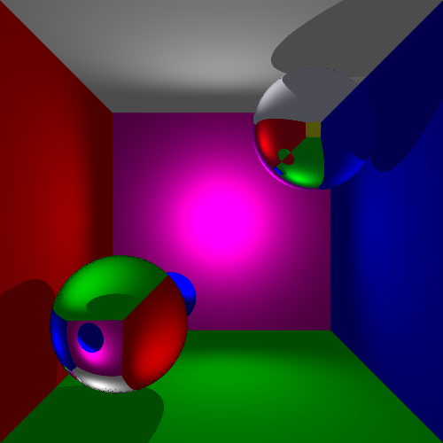

# Ray tracer

This repository contains a ray tracer implementation, written in C++.

### Features
- [x] Primitives (sphere, plane, triangle)
- [x] Light sources (point light, spotlight)
- [x] Orthogonal camera
- [x] Perspective camera
- [x] Adaptive antialiasing
- [x] Reflection
- [x] Refraction 
- [x] Functional .png file export

### Demo

Cornell box rendering:

